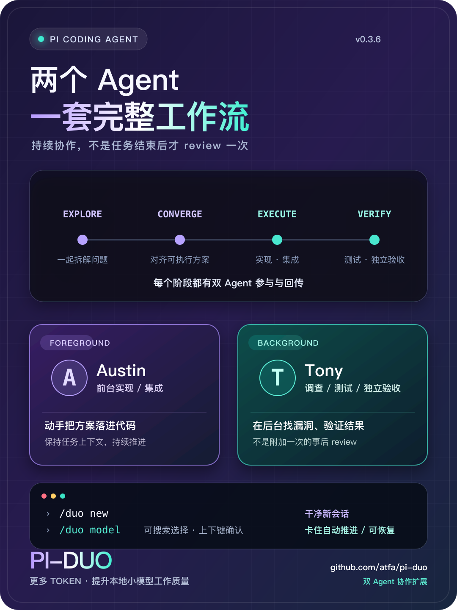
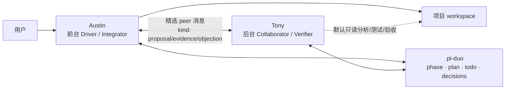

<p align="center">
  
</p>

<h1 align="center">pi-duo</h1>

<p align="center">
  让两个独立、可恢复的 Pi Coding Agent 在同一个项目里协作。<br>
  <strong>Austin</strong> 在前台实现，<strong>Tony</strong> 在后台调查、测试与审查。
</p>

<p align="center">
  <a href="https://github.com/atfa/pi-duo"></a>
  
  
  
</p>

> **0.3.4 提示**：双栏工作台现在采用固定布局、单侧节流刷新与有界可视历史，长会话更稳定。任务彻底完成后，顶部会持续显示 `✓ pi-duo 协作任务彻底完成`；该状态可跨 reload 恢复，不会重复唤醒 Austin。

## 为什么需要 pi-duo？

普通 subagent 往往是一次性调用：主 Agent 提问，子 Agent 返回一段结果，然后上下文消失。pi-duo 采用不同的方式：

- **对等双 Agent**：Austin 和 Tony 都是有独立历史的、可恢复的持久 Pi session；
- **真实 context 通信**：peer 消息进入对方真实 session/context，支持语义分类与彩色渲染；
- **全生命周期状态机**：
  ```text
  user task
     ↓
  EXPLORE (Austin & Tony 独立探索，交换 proposal / evidence)
     ↓
  CONVERGE (方案碰撞，通过 duo_plan 达成工作共识或记录分歧)
     ↓
  EXECUTE (Austin 实现代码，Tony 进行测试、调查与诊断)
     ↓
  VERIFY (Austin 触发 duo_checkpoint，Tony 独立验收)
     ↓
  COMPLETE (确认交付)
  ```
- **首要协作屏障 (First Collaboration Barrier)**：在 EXPLORE 阶段，强制 Austin 等待 Tony 的独立输入或观点碰撞，避免前台 Agent 抢跑；
- **审查与执行解耦**：用户任务到来时不预设审查挂起；review 仅在代码实现完成并显式发起验收时启动；
- **共享工作面**：goal、plan、todo、decisions、workspace ownership 和审计流持久化在项目内；
- **循环保护与单写者**：默认 Austin 唯一修改项目代码，搭配消息预算与防死锁设计。



## 功能概览

- **两个持久 Agent**：Austin 使用当前前台 Pi session；Tony 使用后台 SDK `AgentSession`。
- **可选模型组合**：两个角色可以使用同一模型，也可以使用不同 provider/model。
- **真实 context 通信**：`duo_send` 把消息写入 peer 的持久会话。
- **后台自动协作**：默认每条普通用户任务都会同时派发给 Tony。
- **审查完成门控**：Tony 首份报告到达前，Austin 的终稿会明确标为预备结果；报告到达后自动唤醒 Austin 收口。
- **明确完成信号**：Austin 最终收口且共享 todo 全部关闭后，双栏顶部显示持久完成横幅；下一条用户任务开始时自动清除。
- **共享工作面**：goal、todo、decisions、消息审计和 workspace owner 持久化在项目内。
- **默认单写者**：`austin-only` 模式固定 Austin 为项目文件写入者。
- **高级可转移写锁**：`transferable` 模式允许双方显式交接 workspace ownership。
- **循环保护**：总消息预算、连续 peer-only 限制、相似消息抑制、关键消息 deferred 槽。
- **可靠恢复**：`/duo stop` 保留历史，`/duo resume` 恢复两个 session。
- **中断续接**：若进程停在“Tony 已验收、Austin 尚未最终回复”，reload/resume 会自动恢复最后收口；已 finalized 的任务不会重复执行。
- **有界收口恢复**：Austin 在 `EXECUTE` 中提前结束或返回空响应时自动续接，最多两次；仍未推进则明确暂停，不会无限消耗 token。
- **并发安全**：revision、原子 rename、跨进程锁和 stale-lock recovery。

## 环境要求

- [Pi Coding Agent](https://github.com/badlogic/pi-mono) `0.85.1` 或更高版本；
- Node.js 环境（Pi 安装 Git package 时会安装依赖）；
- 至少一个已经在 Pi 中配置并可调用的模型；
- 若 Austin 与 Tony 使用不同模型，需要两个模型都能被当前 Pi 配置访问。

pi-duo 不内置 API Key，也不绑定 provider。

## 安装

### 方式一：从 GitHub 安装（推荐）

```bash
pi install git:github.com/atfa/pi-duo
```

如果 Pi 当前正在运行，执行：

```text
/reload
```

以后更新所有已安装扩展：

```bash
pi update --extensions
```

移除：

```bash
pi remove git:github.com/atfa/pi-duo
```

> Pi package 拥有与当前用户相同的系统权限。安装第三方扩展前应审查源码。

### 方式二：临时试用，不写入安装配置

```bash
pi -e git:github.com/atfa/pi-duo
```

退出本次 Pi 进程后，临时 package 不再加载。

### 方式三：本地开发 checkout

```bash
git clone https://github.com/atfa/pi-duo.git
cd pi-duo
npm install
pi install "$PWD"
```

如果此前安装过 GitHub 版本，请先移除它再安装 checkout；`/reload` 只会重载当前已安装的来源，不会自动切换到本地源码：

```bash
pi remove git:github.com/atfa/pi-duo
pi install "$PWD"
```

也可以使用 Pi extension discovery 的符号链接方式：

```bash
mkdir -p ~/.pi/agent/extensions
ln -sfn "$PWD" ~/.pi/agent/extensions/pi-duo
```

修改源码后在 Pi 中运行 `/reload`。

若当前 Duo 仍有 `pending` review，新的 `/duo start` 会被拒绝，避免静默丢失正在进行的审查。确实要放弃当前运行时，先执行 `/duo stop`，再重新 `/duo start`。

## 5 分钟快速开始

### 1. 进入目标项目并启动 Pi

```bash
cd /path/to/your-project
pi
```

建议项目已经初始化 Git，并且 `.gitignore` 包含：

```gitignore
.pi-duo/
```

`.pi-duo/` 可能包含 session 历史、模型输出和项目上下文，不建议提交。

### 2. 选择初始模型

先用 Pi 的模型选择功能选好初始模型。执行 `/duo start` 时，当前模型会同时用于 Austin 和 Tony，并写入 `config.json` 的 `agentA` / `agentB`；旧配置不会阻止切换模型。

### 3. 启动 Duo

```text
/duo start --goal "修复支付回调的并发重复入账问题"
```

启动后如需使用不同模型，通过 `/duo model` 调整：

```text
/duo model --tony openrouter/anthropic/claude-sonnet-4.5
```

### 4. 确认状态

```text
/duo status
```

默认应看到类似：

```text
Duo: active
Current role: Austin (foreground agent; not Tony)
Write policy: austin-only
Workspace write owner: Austin
```

### 5. 正常描述任务

之后像平常一样向 Pi 提交任务即可。`autoDispatch=true` 时：

1. Austin 在前台处理用户任务；
2. Tony 在后台收到相同任务和共享状态；
3. Tony 独立读代码、运行只读测试、寻找反例；
4. Tony 通过 `duo_send` 把关键证据发给 Austin；
5. Austin 实现并在关键 checkpoint 请求 Tony 复核；
6. 最终 goal、todo 和 decisions 留在 `.pi-duo/` 中。

## `/duo` 命令完整说明

### Duo 模式的边界

安装或加载扩展不会自动进入 Duo 模式。`/duo start` 会创建 Duo 状态，并把当前 Pi session 绑定为 Austin；只有这个 session 会显示 Duo 状态、注入协作提示并自动调度 Tony。同一工作目录中其他普通 Pi session 不会继承这些行为。

Pi 原生 `/resume` 与 `/duo resume` 解决的是两件不同的事：

- `/resume` 从 Pi 保存的 session 中选择并恢复**一个前台 session**。它不知道 Austin/Tony 的配对关系，也不会单独恢复 Tony。
- `/duo resume` 恢复当前工作目录 `.pi-duo/state.json` 中记录的**一整对 Austin/Tony session**。每个工作目录当前只有一份 Duo 状态，因此它没有、也不需要 session 选择列表。

`.pi-duo` 严格按当前工作目录隔离。父目录和子目录各自存在 `.pi-duo` 时，它们是两组不同的 Duo；请先 `cd` 到创建任务时的目录再执行 `pi` 和 `/duo resume`，否则看到的模型与 session 会属于另一组工作区。

不带 agent 名称的 `/duo stop` 会完整退出 Duo 模式、中止双方当前回合并清除状态提示。`/duo stop austin` 和 `/duo stop tony` 只是定向中止其中一方，不退出整个 Duo 模式。

### 命令速查

| 命令 | 用途 | 中止工作 | 自动触发模型继续工作 |
|---|---|---|---|
| `/duo`、`/duo status` | 显示当前 Duo 状态 | 否 | 否 |
| `/duo start ...` | 新建 Duo，并把当前 session 设为 Austin | 会替换可安全重建的旧状态 | 否，等待用户输入任务 |
| `/duo resume` | 恢复状态中固定的 Austin/Tony session | 否 | 通常否；仅处理中断中的 review 或最终收口，见下文 |
| `/duo model [--austin\|--tony] provider/model` | 切换一方或双方模型并持久化 | 否 | 否；双方必须处于空闲状态 |
| `/duo stop` | 停止 Austin、Tony 和整个 Duo | 是，双方 | 否 |
| `/duo stop austin` | 只停止 Austin 当前回合 | 是，仅 Austin | 否 |
| `/duo stop tony` | 只停止 Tony，Duo 降级运行 | 是，仅 Tony | 会通知正在运行的 Austin 已降级 |
| `/duo history` | 打开双方控制面消息历史 | 否 | 否 |
| `/duo workbench` | 打开双栏实时工作现场 | 否 | 否 |
| `/duo view` | 隐藏/重新显示双栏工作现场 | 否 | 否 |
| `/duo goal [目标]` | 查看或修改共享目标 | 否 | 否 |
| `/duo config ...` | 查看或修改配置 | 否 | 否 |

不存在 `/duo reset`、`/duo clean` 或 `/duo help` 命令。

### 查看状态

```text
/duo
/duo status
/duo history
/duo workbench
/duo view
```

`/duo` 与 `/duo status` 等价：显示运行状态、当前角色、共享目标、todo 进度、两个模型/session、写入策略、workspace owner、消息总数，以及 Austin → Tony、Tony → Austin 各自通过控制面发送的消息次数和最后活动时间。它们只读取状态，不启动或中止模型。这里的次数只统计双方实际发给对方的 Duo 消息，不统计模型内部思考或工具调用。

`/duo history` 打开当前 Duo 回合的聊天式消息历史：Austin 发出的内容靠左，Tony 发出的内容靠右。此时按 `ESC` 只会关闭历史视图并返回 Pi，**不会停止 Austin 或 Tony**。历史视图与工作现场是**互斥的单个 overlay**（Pi 的 `hideOverlay()` 只能弹出最上层），因此打开历史会先隐藏工作现场，ESC 关闭历史后会自动恢复工作现场。

`/duo workbench` 打开双栏实时"工作现场"视图，`/duo view` 则在显示与隐藏之间切换（toggle）。该视图在**进入 Duo 模式时自动打开**：`/duo start` 成功、以及重新载入已有 active session 时都会自动显示，无需再手动执行命令。

视图形态：**上半屏为双栏原生 transcript**（左栏 Austin、右栏 Tony）。姓名下方固定显示双方的模型、交谈次数和分角色工作状态，避免被动态增高的 Pi 底部 dock 覆盖。两栏直接复用 Pi 的 assistant、user 与 tool 组件，历史恢复、流式 thinking、工具执行中的状态与工具结果都按普通 Pi 会话显示；`duo_send` 只是 session 中的一条普通消息。**下半屏保持 Austin 的 Pi 输入框、status 与 footer**，输入只发送给 Austin。

任务真正完成时，姓名分割线下方会固定显示 `✓ pi-duo 协作任务彻底完成`。这是工作台自身的持久完成通知，不是可能被 overlay 遮住的 Pi 临时弹窗；看到该横幅即表示 Tony 已验收、Austin 已完成最终收口且没有未关闭 todo。下一条普通用户任务开始后横幅自动消失。

关键性质与限制：

- **不抢键盘焦点（non-capturing）**：面板常驻显示时输入框仍然可用，你可以一边看双栏一边直接输入下一个任务。
- **各栏独立滚动**：Austin 与 Tony 各有一个原生 `ScrollView`，持续跟随各自 session 的最新输出。
- **有界、按侧刷新**：实时视图只保留最近 40 条可视消息，并且只重建发生变化的一栏；完整 session 历史仍保存在磁盘，不受该显示上限影响。
- **无法做到"真·分屏"**：Pi 的弹性上半区只属于其内部的 transcript 滚动区，扩展 API 无法替换它。因此本视图是覆盖在上半屏的非捕获面板，视觉上等同分屏，但机制上不是把 chat 区域替换掉；`/duo view` 可随时隐藏。

### 创建新的 Duo

```text
/duo start
/duo start --goal "目标"
```

- 当前 Pi session 成为 Austin；
- 当前前台模型同时成为 Austin 与 Tony 的初始模型，并覆盖 `config.json` 中旧的 `agentA` / `agentB`；
- `--goal` 设置初始共享目标；
- 命令完成后只建立双方 session 和工作现场，不会自动执行新任务；下一条普通用户输入才会启动协作。

`--peer` 已移除。需要分开模型时，在启动完成后使用：

```text
/duo model --austin llama/exec
/duo model --tony llama/think
```

省略角色参数会同时切换双方：

```text
/duo model llama/exec
```

模型切换会同步更新两个活跃 session、`.pi-duo/config.json` 与 `.pi-duo/state.json`。为避免正在生成的请求跨模型，目标 Agent 工作中时命令会拒绝执行；等待其空闲或先用 `/duo stop austin|tony` 中止当前回合。`provider/model` 的 model 部分可以继续包含 `/`。

> **注意**：`/duo start` 创建新的共享 Duo 状态，不是恢复命令。已有会话应优先使用 `/duo resume`，避免重新初始化 goal、todo 和 decisions。

### 暂停

```text
/duo stop
/duo stop austin
/duo stop tony
```

`/duo stop` 会立即中止双方并把 Duo 标记为 stopped。`/duo stop austin` 只中止 Austin 当前前台回合，Tony 与 Duo 保持运行；`/duo stop tony` 只中止 Tony，并把当前 pending review 明确标为 failed，Austin 与 Duo 保持运行。Agent 名称不区分大小写（例如 `AUSTIN`、`Tony`、`tOnY` 均有效）。

三种停止方式都会保留 Austin/Tony session 和全部 `.pi-duo` 状态。

Pi 默认的 `ESC` 是“取消或中止”键。Austin 正在前台生成时，按一次 `ESC` 即可请求中止当前 Austin 回合，不需要按两次；它不退出 Duo，也不会连带停止正在后台运行的 Tony。为了明确指定对象，推荐使用：

```text
/duo stop austin   # 只停 Austin 当前回合
/duo stop tony     # 只停 Tony
/duo stop          # 双方都停，并暂停整个 Duo
```

如果 overlay 正在捕获按键（例如 `/duo history`），第一次 `ESC` 的含义是关闭 overlay，而不是中止 agent；回到输入界面后再使用上面的明确命令。

### 恢复

```text
/duo resume
```

恢复 `.pi-duo/state.json` 中已保存的 Austin 前台 session 和 Tony 后台 session：

1. 如果当前 Pi session 不是已保存的 Austin，pi-duo 会直接切换到准确的 Austin session；
2. Austin session 载入后，pi-duo 从状态中恢复准确的 Tony session；
3. 双栏工作现场自动重新打开。

这里没有选择列表是有意的：Duo 状态已经保存了两个 session 的 ID 和文件路径，用户无需再次配对。如果想恢复另一段普通 Pi session，请使用 Pi 原生 `/resume`；如果想把它建立成一组新的 Duo，请在那个 session 中执行 `/duo start`。

正常的 `/duo resume` **不会自动开始新任务，也不会在没有用户提示词时让双方继续闲置工作**。`autoDispatch=true` 只在用户提交一条非命令文本时，才把该任务同时调度给 Tony。例外是未完成的旧控制流程：恢复时若状态仍在 `EXECUTE`、存在被打断的 `pending` Tony review，或 Tony 已验收但 Austin 尚未完成最终回复，pi-duo 会自动唤醒 Austin 继续原任务；不会创建新任务。

如果状态已经持久化为 finalized，`/reload` 和 `/duo resume` 只恢复双栏及完成横幅，不会再次唤醒 Austin。若看到双方“已完成”但尚无完成横幅，则表示最终完成记录尚未落盘，pi-duo 会继续一次收口回合。

### 崩溃或重启后的推荐恢复步骤

```text
cd <原工作目录>
pi
/duo resume
/duo status
```

确认状态中的 Austin/Tony session、模型和消息计数正确后，再输入下一条任务。通常不必先执行 Pi 的 `/resume`：`/duo resume` 会自行切回保存的 Austin。只有 `.pi-duo/state.json` 不存在、损坏，或你只是想打开一个与 Duo 无关的普通 session 时，才使用 `/resume`。

### 查看或修改目标

```text
/duo goal
/duo goal "新的共享目标"
```

### 修改配置

```text
/duo config key=value [key=value ...]
```

示例：

```text
/duo config autoDispatch=false
/duo config writePolicy=transferable
/duo config tonyExtensions=pi-web-access,pi-lens
/duo config maxPeerMessagesPerTurn=4 maxDeferredMessagesPerTurn=2
/duo config maxConsecutivePeerTurns=2 similarityThreshold=0.92
```

修改后会显示完整生效配置。

## 配置文件与全部开关

每个项目使用独立配置：

```text
<project>/.pi-duo/config.json
```

完整示例见 [`config.example.json`](config.example.json)：

```json
{
  "agentA": {
    "provider": "your-austin-provider",
    "modelId": "your-austin-model"
  },
  "agentB": {
    "provider": "your-tony-provider",
    "modelId": "your-tony-model"
  },
  "tonyExtensions": ["pi-web-access", "pi-lens"],
  "maxPeerMessagesPerTurn": 6,
  "maxDeferredMessagesPerTurn": 2,
  "maxConsecutivePeerTurns": 3,
  "similarityThreshold": 0.9,
  "autoDispatch": true,
  "writePolicy": "austin-only"
}
```

| 配置项 | 默认值 | `/duo config` | 说明 |
| --- | --- | --- | --- |
| `agentA` | 启动时记录 | 否 | Austin 的 `{provider, modelId}`；由 `/duo start` 或 `/duo model` 更新。 |
| `agentB` | 启动时记录 | 否 | Tony 的 `{provider, modelId}`；初始与 Austin 相同，可由 `/duo model` 分开。 |
| `tonyExtensions` | `["pi-web-access", "pi-lens"]` | 是 | Tony 专用扩展白名单。只接受已安装的 npm 包名；不会继承 Austin 的其他扩展。 |
| `autoDispatch` | `true` | 是 | `true`：每个普通用户任务自动派发给 Tony；`false`：只在 Austin 显式调用 `duo_send` 时联系 Tony。 |
| `writePolicy` | `"austin-only"` | 是 | `austin-only` 或 `transferable`，详见下文。 |
| `maxPeerMessagesPerTurn` | `6` | 是 | 每个用户回合最多触发多少条 peer 消息，最小值为 `4`，避免审查、修复和复验闭环因配置而死锁。最后一个触发槽保留给 `important`/`decision`。 |
| `maxDeferredMessagesPerTurn` | `2` | 是 | 触发预算耗尽后，额外允许持久化多少条高优先级消息；这些消息不会立即启动新模型回合。 |
| `maxConsecutivePeerTurns` | `3` | 是 | 没有实质工具活动时，允许连续发生的 peer-only 消息数量。 |
| `similarityThreshold` | `0.9` | 是 | `0–1` 相似度阈值；消息相似度达到阈值即抑制。越低越激进，越高越只拦截近似重复。 |

布尔值使用小写 `true`/`false`。配置数值应使用合理的正数；过大的消息预算会增加费用和上下文噪声。

旧配置缺少新字段时会自动补默认值；非法 `writePolicy` 会回退到 `austin-only`。

### Tony 扩展白名单

Tony 默认加载 `pi-web-access` 与 `pi-lens`，以及 pi-duo 自己的协作工具；不会加载 Austin 的 SoL-Pi、cc-extensions、footer 等其他扩展。两个默认包须已通过 Pi 安装。

```text
/duo config tonyExtensions=pi-web-access,pi-lens
/duo config tonyExtensions=none
```

值是逗号分隔的 npm 包名，`none` 表示不加载额外扩展。修改只写入项目的 `.pi-duo/config.json`；为避免在生成途中替换工具集，需要 `/reload` 或停止并恢复 Tony 后才对 Tony session 生效。白名单包缺失时 Pi 会报告扩展加载错误，不会退回到加载全部扩展。

## 两种写入策略

### `austin-only`（默认、推荐）

```text
/duo config writePolicy=austin-only
```

- Austin 是唯一项目文件写入者；
- Tony 负责只读调查、测试、反例、审查和验收建议；
- Tony 的 `edit`、`write` 以及可识别的 mutating shell 命令会被阻止；
- workspace owner 固定为 Austin；
- `release`、`transfer` 和 Tony `acquire` 不可用；
- `.pi-duo` 共享元数据和 Tony session 持久化不算项目文件修改。

这种模式减少锁争夺、并行覆盖和控制面来回交接，适合大多数任务。

Tony 编写临时验证时，推荐使用不落盘的命令：

```bash
node -e '/* inline check */'
node --input-type=module <<'NODE'
// check code from stdin
NODE
```

### `transferable`（高级）

```text
/duo config writePolicy=transferable
```

- workspace owner 可以是 Austin、Tony 或 `none`；
- 只有当前 owner 可以执行可识别的项目写操作；
- Agent 可通过 `duo_workspace acquire/release/transfer` 交接；
- release/transfer 属于控制面事件，即使普通消息预算耗尽也会唤醒 peer；
- 工具会先返回已提交的 ownership 快照，不等待 peer 完整回合。

仅在双方确实需要分阶段写入时使用。当前版本不提供 Git worktree 自动隔离，也不建议双方同时写文件。

## Agent 可调用的工具

这些工具由模型自动调用，用户通常不需要手工操作。

### `duo_send`

向 peer 的真实持久 context 发送精选消息。

参数：

- `message`：消息正文；
- `importance`：`normal`、`important` 或 `decision`；
- `kind`（可选）：消息语义分类：
  - `proposal` / `idea`：💡 方案与构想
  - `evidence`：🔬 实验、日志与代码证据
  - `objection`：⚠️ 异议与风险提示（记录分歧，支持 agree or disagree-and-proceed）
  - `checkpoint`：🏁 里程碑提示
  - `verification`：✅ 独立验证通过
  - `finding`：🔍 验收或调查发现的问题
  - `question`：❓ 关键提问
  - `decision`：📋 决策同步
- `reviewComplete`：仅 Tony 在验收阶段使用；只有完成对当前交付物的独立验证后才设为 `true`。控制面会自动原子完成 `VERIFY → COMPLETE` 跃迁并唤醒 Austin；Tony 不需要且不能在 `reviewComplete` 后调用 `duo_checkpoint(action="complete")`。
- `reviewFinding`：仅 Tony 在验收阶段使用；发现需要 Austin 修改的问题时设为 `true`。控制面会自动将生命周期退回 `EXECUTE` 阶段，并清除活跃的待决 review。Austin 修复问题后重新调用 `duo_checkpoint(action="ready_for_verification")` 开启新的独立复验。

> **注意**：`kind` 仅用于消息语义、审计和 UI 展示，不直接改变 collaboration phase 或 review lifecycle。阶段转换由 `duo_plan(commit)`、`duo_checkpoint` 和带 `reviewComplete`/`reviewFinding` 的控制面操作完成。

### 统一执行门禁 (Execution Gate)

项目工作区的修改受协作阶段严格控制：

- **Only EXECUTE permits the current workspace owner to modify project files.** 无论 owner 是 Austin 还是 Tony，`EXPLORE` 与 `CONVERGE` 都会拦截集成工作区修改；Tony 的 `.pi-duo/tmp/tony` scratch 写入不受此限制。
- **VERIFY freezes the project workspace while Tony independently verifies the deliverable.** 在 `VERIFY` 阶段，交付物进入冻结状态，所有 actor 都不能修改项目文件。
- **After COMPLETE, the workspace owner must explicitly reopen before changing verified project files.** 在 `COMPLETE` 阶段，交付物属于已验证的完成状态；需先由 Austin 调用 `duo_checkpoint(action="reopen")` 退回 `EXECUTE`。
- **Tony reviewFinding returns the collaboration to EXECUTE. Austin fixes the issues and starts a fresh verification checkpoint.** 当 Tony 发现缺陷并提交 `reviewFinding=true` 时，状态机自动退回 `EXECUTE` 阶段并解除写入限制；Austin 修复后重新发起 `ready_for_verification`。
- **Degraded mode bypass**：若 Tony 启动失败或异常导致 `collaboration.degraded === true`，仅 Austin 可在 `EXPLORE/CONVERGE` 继续单 Agent 工作；`VERIFY/COMPLETE` 仍冻结，`EXECUTE` 仍按 owner/writePolicy 决定。

`important` 和 `decision` 可以使用保留槽，并在总预算耗尽后进入 deferred 持久化槽。

### `duo_plan`

维护双方的工作方案共识（Working Agreement），驱动 `CONVERGE -> EXECUTE` 阶段跃迁：

- `get`：读取当前共识方案及未决异议；
- `propose` / `revise`：提出或修正方案；双方均有贡献且完成独立探索后才进入 `CONVERGE`；
- `commit`：仅 Austin 可执行；必须在 `CONVERGE` 阶段且双方均已提供贡献后，才正式敲定方案进入 `EXECUTE` 阶段；
- `unresolvedObjection`：允许保留无法消除的技术分歧，不追求虚假共识。

### `duo_checkpoint`

驱动 `EXECUTE -> VERIFY -> COMPLETE` 阶段跃迁，将 Review 解耦并移至交付终点：

- `status`：查看当前协作阶段与验收状态；
- `ready_for_verification`：仅 Austin 在 `EXECUTE` 且 Tony 当前可用时调用；代码实现完成后主动发起验收请求，唤醒 Tony 切换为独立验收模式（进入 `VERIFY` 阶段）。Tony 不可用时请求会被拒绝，不会留下 pending review；
- `complete`：正常由 Tony `reviewComplete=true` 自动完成；此命令仅供 Austin 手动确认已 reported 的验收；
- `reopen`：仅 Austin 在 `VERIFY` 或 `COMPLETE` 阶段调用；验收发现严重问题时重新打开回到 `EXECUTE` 阶段。

### `duo_status`

读取当前角色、phase、plan、review、goal、todo、模型、session、策略、workspace owner 和活动状态。

### `duo_goal`

- `get`：读取目标；
- `set`：原子更新目标；
- 可选 `expectedRevision` 用于 optimistic concurrency。

### `duo_todo`

支持：

- `list`
- `add`
- `update`
- `remove`

状态值：

- `pending`
- `in_progress`
- `done`
- `blocked`

todo 可指定 `owner: austin | tony`，并支持 `expectedRevision` 防止并发覆盖。`duo_todo` 仅管理工作项，不改变协作阶段；只有 `duo_plan(action="commit")` 才会正式推进 `CONVERGE → EXECUTE`。

### `duo_decisions`

列出或添加持久决策；每条决策可以包含 `evidence`，并自动记录 author 和时间。

### `duo_workspace`

- `status`
- `acquire`
- `release`
- `transfer`（需要 `to: austin | tony`）

在 `austin-only` 模式中只有状态查询和 Austin ownership 归一化有效；完整交接仅用于 `transferable`。

## 消息预算与循环保护

一次用户输入定义一个 user turn。默认流程：

1. 最多触发 6 条 peer 消息；
2. 普通消息只能使用前 5 个槽；
3. 最后一个触发槽保留给关键结果或决策；
4. 预算耗尽后，最多再保存 2 条 `important`/`decision`；
5. deferred 消息进入 peer 持久 context 和 `messages.jsonl`，但不触发模型回合；
6. 重复消息先经过相似度检查，因此重试同一条 deferred 消息不会继续占槽；
7. 下一次用户输入会重置 per-turn 预算。

如果工具提示消息“saved without triggering another turn”，Agent 应继续独立工作，不要重复发送。

## 数据与持久化

```text
.pi-duo/
├── config.json       # 模型、策略与预算开关
├── state.json        # goal、todo、decisions、agent/session 元数据
├── messages.jsonl    # 精选 peer 消息审计日志
├── decisions.md      # 人类可读的决策记录
├── sessions/         # Tony 的原生 Pi JSONL session
└── .lock/            # 短暂出现的跨进程写锁目录
```

Austin 的原生 session 仍保存在 Pi 的正常 session 目录中；`state.json` 只保存引用，不复制完整 conversation。

共享状态更新采用：

- 单调递增 revision；
- 可选 `expectedRevision`；
- 临时文件 + 原子 rename；
- 跨进程锁目录；
- stale lock 自动恢复。

## 模型选择建议

- **同模型**：输出风格一致，配置简单，但认知多样性有限；
- **不同模型**：更容易获得独立反例和不同实现视角；
- Tony 不一定需要最昂贵的模型，擅长代码审查和测试即可；
- provider 的订阅/免费层可能限制从 Pi 调用，先在普通 Pi session 中确认模型可用；
- `autoDispatch=true` 会让正常任务调用两个模型，请留意费用和速率限制。

## 安全边界与已知限制

- pi-duo 是 Pi extension，不是容器、VM 或 OS 权限沙箱；
- shell 分类器只能阻止可识别的写命令；测试、构建和任意脚本仍可能创建文件；
- `austin-only` 是协作纪律和工具保护，不是恶意代码隔离；
- Tony 可通过 `write`/`edit` 在 `.pi-duo/tmp/tony/` 创建一次性测试 harness，再用只读 shell 命令运行；项目文件写入仍会被阻止；
- 两个 Agent 共享同一个工作目录，不提供自动 Git worktree；
- 当前 UI 只显示前台 Austin，Tony 在后台运行；
- deferred 消息不会立即触发模型回合；
- 当前目标是可靠双 Agent，不支持 N-agent、投票、RAG、外部数据库或 Web UI；
- 在不受信任的仓库中使用前，应先阅读代码并使用隔离环境。

## 常见问题与排障

### `/duo` 命令不存在

1. 确认 package 已安装：`pi list`；
2. 当前 Pi 中运行 `/reload`，或重启 Pi；
3. 本地开发模式下检查 `~/.pi/agent/extensions/pi-duo` 链接。

### 模型切换被拒绝

`/duo model` 只在目标 Agent 空闲时切换。等待当前回合完成，或先用 `/duo stop austin`、`/duo stop tony` 中止对应回合；模型不可用时先确认 provider 凭证和模型 ID。

### Tony 模型 unavailable / provider error

先在普通 Pi session 中选择并调用该模型，确认 provider 凭证、订阅权限和模型 ID 正确。pi-duo 不绕过 provider 限制。

### Tony 没有自动收到任务

检查：

```text
/duo status
/duo config autoDispatch=true
```

`autoDispatch=false` 时，只有 Agent 显式调用 `duo_send` 才会联系 peer。

### 消息显示 deferred

当前用户回合的触发预算已经耗尽。消息已安全进入 peer context 和审计日志，但不会立即启动新回合。不要重复发送；继续当前任务或等待下一条用户输入。

### Tony 的 shell 命令被阻止

默认 `austin-only` 会拦截可识别写命令。Tony 应改用只读检查，或用 `write`/`edit` 把一次性 harness 写到 `.pi-duo/tmp/tony/` 后运行，并把建议发给 Austin。确实需要 Tony 修改项目文件时，再显式切换到 `transferable` 并交接 ownership。

### todo 已完成但状态仍 pending

pi-duo 会把带有 `pending`/`in_progress` 共享 todo 的终稿标为尚未完成，并自动追加一次收口回合。Austin 应调用 `duo_todo update`：已完成项标为 `done`，确实未完成的项保留为 `pending` 或 `blocked` 并向用户说明。

若 Austin 在 `EXECUTE` 阶段结束生成却没有发起复验，pi-duo 会自动追加收口提示；空 assistant 响应也按同样方式处理。每个用户回合最多自动恢复两次，之后双栏会显示“收口暂停”，等待用户决定是否继续。双栏旋转状态只来自真实的 `agent_start/agent_end`，因此工作流仍处于 `EXECUTE` 时也不会错误显示双方一直在运行。

### Austin 显示 preliminary / Tony review pending

这表示 Austin 已产生阶段性结果，但 Tony 的当前自动审查尚未返回。它不是最终完成信号。Tony 首份报告到达后会自动唤醒 Austin；无需发送新提示，也不要让 Austin 用 sleep/poll 等待。

### 如何查看协作是否真实发生？

检查：

```bash
cat .pi-duo/messages.jsonl
cat .pi-duo/decisions.md
```

Tony 的完整历史位于 `.pi-duo/sessions/`，Austin 的完整历史保留在 Pi session 目录。

## 开发与离线验证

```bash
git clone https://github.com/atfa/pi-duo.git
cd pi-duo
npm install
npm run check
npm test
npm pack --dry-run
```

以上检查不调用远程模型 API。真实双 Agent smoke test 会产生模型调用费用，建议在一次性项目中进行。

主要文件：

```text
index.ts                 extension 入口、生命周期、命令与工具
src/store.ts             持久化、锁、原子状态与 shell 分类
src/coordinator.ts       投递策略、LoopGuard、ownership 规则
src/types.ts             共享类型
test/*.test.ts           离线回归测试
config.example.json      完整配置示例
assets/pi-duo-xhs.png    3:4 宣传图
```

## 项目状态

当前定位：**v0.3.4 beta / release candidate**。

已经过以下真实场景验证：

- 两个独立持久 session 的启动、停止、恢复；
- 双向 peer context 投递；
- reload/session replacement 后的 stale callback 隔离；
- Austin-only 写保护；
- transferable 双向 handoff；
- 超预算关键消息持久化；
- todo/decisions 收敛；
- 两个完整浏览器小游戏项目的协作开发与独立复核。

欢迎通过 [GitHub Issues](https://github.com/atfa/pi-duo/issues) 报告问题。提交 issue 时请隐藏 API Key、私有源码和 session 中的敏感内容。
